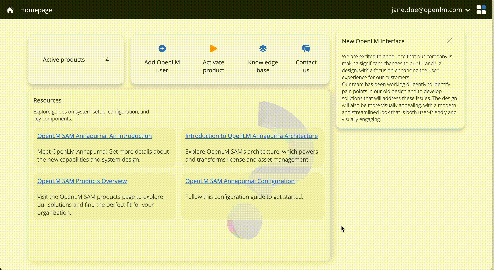

# Agent Activity Manager

## Description
The Agent Activity Manager monitors the connected Workstation Agents installed on end users' workstations. You can also restart or remove obsolete Workstation Agents.

## Prerequisites
At least one Workstation Agent must be installed and connected to either an on-premises or cloud deployment.

## Install and connect a Workstation Agent

1. Verify that the workstation meets the system requirements. See the [system requirements](/).

2. Download the Workstation Agent from the [OpenLM downloads page](/).

3. Run the Workstation Agent installer. Accept the License Agreement and select **Next**.

4. Select applicable extensions if the related applications are installed on the workstation. If no listed applications are installed, leave the boxes unchecked. Select **Next**.

5. Choose an installation path or use the default. Select **Next**.

6. Select either **On-premises** or **Cloud**, based on your deployment type. Select **Next**.

### For both Cloud and On-premises deployments
7. Select whether end users can access their Personal Dashboard (license repository and related information). See the [dashboard guide](/). Select **Next**.

### For On-premises deployments only
8. Choose whether to enable Dongle Monitoring. See the [Dongle Monitoring guide](/). Select **Next**.

9. Enter the fully qualified domain name (FQDN) and check connectivity on port 443. Select **Next**.

### For both Cloud and On-premises deployments
10. Import the Agent Authorization File created in the Identity microservice. Select **Next**.

### Prepare the Agent Authorization File
Your deployment uses OAuth protocol and token authentication. Authenticate each component individually.

- Navigate to the [Identity microservice](/).
- Select **ADD CLIENT** for the Agent.
- Save, issue, and download the Agent Authorization File.

11. Select **Finish** to complete the installation.

## Verify connection and manage Agents

You can view connected Agents, including details like host name, user name, IP address, and Agent version.

Monitor Agent connectivity status and perform remote restarts. You can also identify and remove obsolete or unnecessary Agents.

