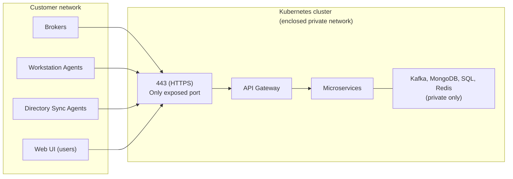

This page describes the network requirements for the OpenLM Platform across all deployment paths.

## Conceptual overview

The OpenLM Platform exposes a **single HTTPS (port 443) ingress endpoint**. This is the only port that needs to be accessible from outside the cluster network. All communication from field agents and users accessing the web UI flows through this single endpoint.

:::info[HTTP to HTTPS redirect]
Port 80 (HTTP) is also typically exposed on the ingress controller to redirect HTTP requests to HTTPS. No application traffic is served over HTTP.
:::

**The Kubernetes cluster, its nodes, infrastructure services, and internal networking can reside on a fully enclosed private network.** OpenLM does not require any inbound access to the cluster internals from the outside. There is no remote management and no outbound communication to external systems. The only external exposure is the HTTPS ingress configured during deployment.

### Inbound traffic

All inbound traffic enters through a single HTTPS (443) ingress endpoint:

| Source | Protocol | Port | Purpose |
| --- | --- | --- | --- |
| **Broker** | HTTPS | 443 | License server event collection. Installed on machines running license servers. |
| **Workstation Agent** | HTTPS | 443 | Workstation usage event collection. Installed on end-user workstations. |
| **Directory Sync Agent (DSA)** | HTTPS | 443 | Directory scanning and synchronization events. Installed on a machine with directory access. |
| **Web UI** | HTTPS | 443 | Users accessing platform administration, dashboards, and reporting. |

All agents and users connect to the same fully qualified domain name (FQDN) configured during deployment. No direct access to Kubernetes nodes, API server, databases, or any internal service is required from outside the cluster network.

### Outbound traffic

The Kubernetes cluster requires outbound access only for pulling container images:

| Destination | Protocol | Port | Purpose |
| --- | --- | --- | --- |
| `public.ecr.aws/r3q3q2f4` | HTTPS | 443 | OpenLM container image registry |

No other outbound connectivity is required from the cluster at runtime. The platform does not communicate with any external OpenLM servers – it runs entirely within your network. If your environment uses an HTTP proxy or firewall allowlist, add the registry endpoint listed earlier.

:::info[External integrations]
The platform can also integrate with external services such as ServiceNow. If such integrations are configured, outbound access to those endpoints will be required as well. Add any integration endpoints to the firewall allowlist as needed.
:::

:::tip
For air-gapped environments, container images can be pre-loaded into a private registry. Contact OpenLM for guidance on offline image distribution.
:::

### TLS certificates

The TLS certificate must be trusted by every machine that connects to the platform, including agent machines, user browsers, and services inside the cluster that call back to the FQDN. This is critical for successful HTTPS connections.

See [TLS certificates](./tls-certificates) for full requirements, configuration steps, and a troubleshooting guide.

## On-premise machines

In addition to the platform-level requirements described earlier, on-premise Kubernetes clusters require inter-node communication and management access.

### Inter-node ports (all nodes)

The following ports must be open between all nodes.

| Port | Protocol | Purpose |
| --- | --- | --- |
| 6443 | TCP | Kubernetes API server |
| 8472 | UDP | Flannel VXLAN overlay network |
| 10250 | TCP | Kubelet metrics |
| 51820 | UDP | Flannel WireGuard (if activated) |

### Role-specific ports

The following ports apply to specific node roles.

| Node role | Port | Protocol | Purpose |
| --- | --- | --- | --- |
| Control plane | 80 | TCP | HTTP ingress (redirect to HTTPS) |
| Control plane | 443 | TCP | HTTPS ingress (agents, UI, API) |
| Infrastructure | 30432 | TCP | PostgreSQL NodePort for Power BI / external reporting tools |

### Network topology

The following constraints apply to the cluster network layout.

- All nodes must reside on the same L2 network or have full inter-node connectivity with no port restrictions between them.
- The control plane node is the ingress entry point. DNS should resolve to this node's IP or a load balancer in front of it.
- Administration access (SSH, port 22) is required on all nodes for management.

### Outbound (provisioning)

During initial setup, nodes also need access to the following endpoints.

| Destination | Purpose |
| --- | --- |
| `public.ecr.aws/r3q3q2f4` | OpenLM container images |
| Kubernetes distribution source | Kubernetes installation (varies by distribution) |
| AlmaLinux / RHEL mirrors | OS package updates (`dnf`) |

After installation, only the container registry endpoint is required.

## Private cloud (AWS)

On AWS, networking is handled through a VPC with public and private subnets.

### VPC layout

The following table describes the VPC components.

| Component | Detail |
| --- | --- |
| VPC CIDR | `/22` block (for example, `10.0.0.0/22`) |
| Private subnets | 3 (one per availability zone) – EKS nodes and managed services |
| Public subnets | 3 – load balancers and NAT gateway |
| NAT gateway | 1, for outbound internet from private subnets |
| S3 endpoint | Gateway endpoint for S3 access without NAT |

### Security groups

The following security group rules control traffic between services.

| Service | Allowed source | Port | Protocol |
| --- | --- | --- | --- |
| EKS API server | Configured CIDRs (`eks_public_access_cidrs`) | 443 | TCP |
| RDS SQL Server | EKS cluster security group | 1433 | TCP |
| MSK (Kafka) | EKS cluster security group | 9096 | TCP |
| ElastiCache (Redis) | EKS cluster security group | 6379 | TCP |

### Ingress

External traffic (agents and users) reaches the cluster through an AWS load balancer in the public subnets, forwarding to the ingress controller in the private subnets on ports 443 and 80.

### Outbound

Outbound traffic from the cluster uses the following paths.

- Workload nodes in private subnets reach the internet through the NAT gateway.
- Container images are pulled from `public.ecr.aws/r3q3q2f4` through NAT.

## Private cloud (Azure)

On Azure, networking uses a VNet with Azure CNI mode for AKS.

### VNet layout

The following table describes the VNet components.

| Component | Detail |
| --- | --- |
| VNet CIDR | `/22` block (for example, `10.0.0.0/22`) providing 1,024 IP addresses |
| Networking mode | Azure CNI (each pod gets a VNet IP) |
| IP capacity | ~400 IPs for pods, nodes, and growth |

### Network sizing

With Azure CNI, every pod consumes an IP address from the VNet:

- ~29 pod IPs per node
- 6–7 nodes provide ~174–203 pod IPs
- ~143 running pods plus node IPs fit within a `/22` block with room for growth

### Ingress

External traffic enters through an Azure load balancer or Application Gateway on ports 443 and 80, forwarding to the AKS ingress controller.

### Managed service connectivity

Azure SQL Managed Instance and Azure Cache for Redis are accessed over private endpoints or VNet integration. No public internet exposure is required for managed services.

### Outbound

Outbound traffic from the AKS cluster uses the following paths.

- AKS nodes pull container images from `public.ecr.aws/r3q3q2f4`.
- Configure the AKS outbound type and firewall rules to allow access to the registry endpoint.
