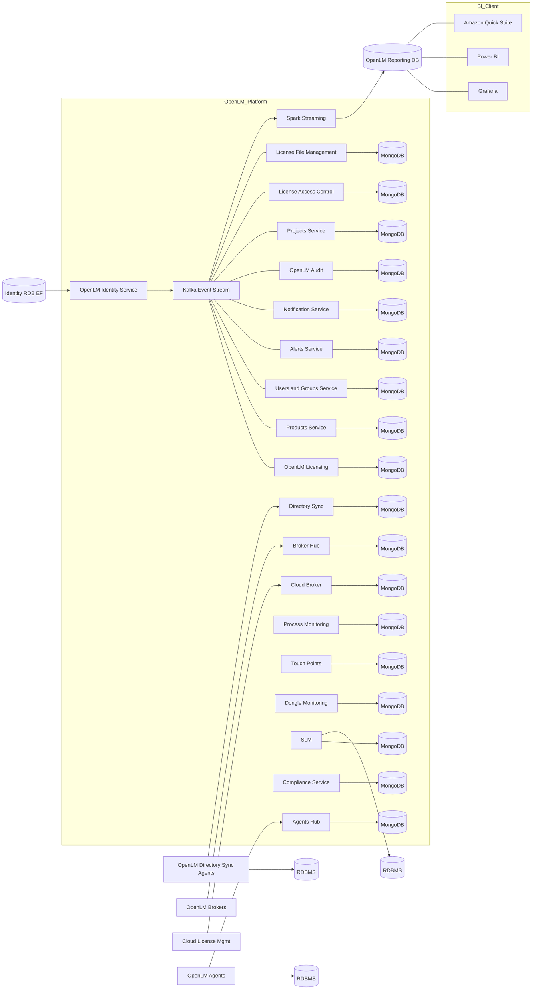

# OpenLM Platform architecture

:::info[When to read this]
This page is for administrators and architects who need to understand how the platform processes data internally. If you are setting up OpenLM for the first time, start with the [Prerequisites](./prerequisites) page instead.
:::

OpenLM Platform collects application and executable data through Workstation Agents and Brokers. These components connect to OpenLM Gateway, which represents the organization’s fully qualified domain name (FQDN) or DNS name. The gateway forwards the data to OpenLM services, which stores it in appropriate databases.

## Key components

The platform consists of the following components.

- **Workstation Agents**: Collect data from individual user machines.  
- **Brokers**: Run on license manager servers. They collect license usage data and send it to relevant services.  
- **OpenLM Gateway**: Serves as entry point and routes data to individual services.  
- **OpenLM Services**: Process, enrich, and manage the collected data.  
- **Databases**: Store processed data in dedicated systems, such as the server database, identity service database, DSS database, and reporting database.

## Microservices and Kubernetes

OpenLM Platform runs on microservices deployed in a Kubernetes cluster.  
Each service runs inside a container within a pod on a Kubernetes node.  
Services store their data in internal databases and use Kafka as a message queue for asynchronous processing.

## Architecture levels

### Level 1: High-level data flow

- Workstation Agents, Brokers, and other services write data to their own databases.  
- Services publish data to Kafka topics.  
- The Reporting Service aggregates Kafka data.  
- The Reporting Service stores data in the reporting database.  
- The reporting dashboard reads data from the reporting database.

*OpenLM Platform Level 1 architecture*

### Level 2: Detailed data pipeline

- Workstation Agents and Brokers collect data from PCs and servers.  
- Agent Hub and Broker Hub consolidate this data.  
- Data from Agent Hub and Broker Hub is saved to MongoDB and Kafka.  
- Other services (User, Project, Server) consume relevant Kafka topics.  
- The Enrichment Service merges and enhances data from all services, then publishes it back to Kafka.  
- Apache Spark aggregates the enriched Kafka data for reporting.  
- Spark writes results to the reporting database.  
- Business intelligence tools access the reporting database.

*OpenLM Platform Level 2 architecture*

### Comprehensive architecture 

The diagram represents the broader OpenLM Platform architecture, including identity, event streaming, hubs, monitoring, core services, and reporting flows.

Explore dependencies and relationships in the [interactive service map](/cloud/service-map).

## Enrichment services

OpenLM Platform includes enrichment services to consolidate and enhance the collected data:

- **Allocation Enrichment Service**: Adds allocation data using allocation IDs.  
- **Usage Enrichment Service**: Enhances usage data using session IDs.  
- **Denials Enrichment Service**: Processes denial data using denial IDs.

## Data storage and recovery

OpenLM Platform uses a staging database to support data recovery in case of loss or corruption.  
This staging data is later moved to MongoDB, which serves as an internal recovery source.
