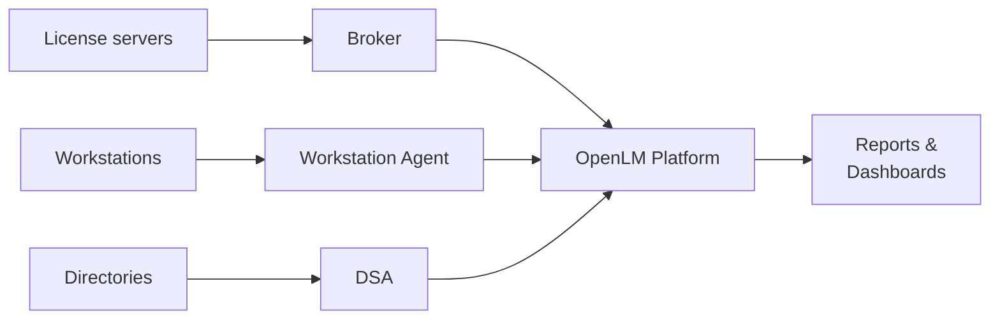

# What is OpenLM?

OpenLM is a software license management and software asset management (SAM) platform for engineering, scientific, and technical environments. It collects usage data from license servers and user workstations, processes it through a centralized cloud platform, and delivers actionable reports for compliance, cost optimization, and access control.

OpenLM supports more than 100 license managers, including FlexNet, DSLS, Sentinel RMS, Reprise, and LM-X, as well as cloud-based licensing platforms such as Autodesk Cloud.

## How OpenLM works

OpenLM uses three on-premises components to collect data:

- **Broker** runs on your license server and collects license usage data.
- **Workstation Agent** runs on end-user machines and collects application activity data.
- **Directory Synchronization Agent (DSA)** syncs user and group data from your directories (LDAP, Azure AD).

These components send data to the OpenLM Platform, which processes, enriches, and stores it. You access the results through dashboards and reports.

For a detailed view of the microservices architecture, Kafka event streaming, and data pipeline, see [OpenLM Platform architecture](./architecture).

## Choose your path

  

    

      

        <h3>IT Administrators</h3>
      

      

        
Deploy the platform, install on-premises components, and connect your license servers.

      

      

        <a className="button button--primary button--block" href="/cloud/getting-started/prerequisites">Start setup</a>
      

    

  

  

    

      

        <h3>License Managers</h3>
      

      

        
Configure license policies, set up automations, and monitor compliance.

      

      

        <a className="button button--primary button--block" href="/cloud/category/software-license-manager-slm">SLM and Automations</a>
      

    

  

  

    

      

        <h3>End Users</h3>
      

      

        
Check license availability, view your dashboard, and understand the Workstation Agent.

      

      

        <a className="button button--primary button--block" href="/cloud/category/for-end-users">For End Users</a>
      

    

  

## Key capabilities

| Capability | Description | Learn more |
|---|---|---|
| Compliance and audit readiness | Generate vendor-compliant reports, enforce usage policies, and detect unauthorized activity. | [Compliance](/cloud/compliance) |
| Cloud license management | Monitor and control SaaS and token-based licensing models. | [Cloud Broker](/cloud/data-collection/cloud-broker) |
| Advanced usage analytics | View real-time and historical usage data by user, feature, or workstation. | [Reporting](/cloud/category/reporting) |
| Policy enforcement and access control | Automate license release, apply access restrictions, and reduce denials. | [License Access Control](/cloud/automations/lac) |
| Enterprise integration | Connect to LDAP, SAML, ITSM platforms, and reporting tools. | [Integrations](/cloud/category/integrations) |
| Multi-environment coverage | Manage licenses across distributed, virtualized, and cloud-hosted environments. | [Deployment](/cloud/category/deployment--operations) |

:::tip[New to OpenLM terminology?]
See the [Glossary](/cloud/glossary) for definitions of key terms used throughout this documentation.
:::

:::info[Next step]
Ready to set up OpenLM? Continue to [Prerequisites](./prerequisites) to review what you need before you begin.
:::
