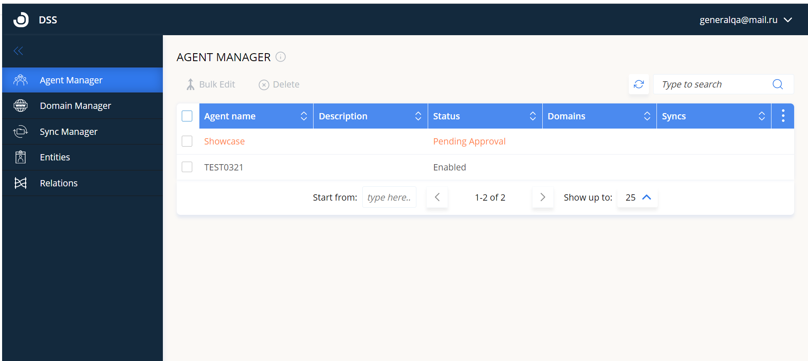

This is a short guide on setting up Cloud Directory Sync.

> For a full, in‑depth explanation, see the [Directory Synchronization comprehensive guide (v21 and higher)](/legacy/directory-sync/configuration).

## Prerequisites

- [Account in Software License Management Cloud (SLMC)](/legacy/slmc/)
- *Contact Support (support@openlm.com) to create a DSS database for your account.*

## Generate the DSA authorization file and connect DSA and DSS (part one)

To allow the Directory Synchronization Agent (DSA) to interact with the Directory Synchronization Service (DSS), generate an authorization file from the EasyAdmin interface:

1. Log into your Software License Management Cloud account.
2. Go to **System & Security** → **Security** → **Authorization**.
3. Select **Add** and select **DSA** from the dropdown list to download the Authorization JSON file. Provide a meaningful description and select **SAVE**. The Secret Key will be displayed only once—store it securely before closing the window.

## Install Directory Synchronization Agent (DSA)

1. Download the latest DSA installer from the OpenLM Downloads page and run it.
2. Check the "I agree to the license terms and conditions" box and select **Next**.
3. Enter a descriptive name (no spaces) for the Agent instance, confirm or change the port (default `8081`), select **Cloud** as the Server version, then select **Next**.
4. Import the authorization file using one of the options:
	- **Browse** to import the Authorization JSON file.
	- **Enter** the authorization details manually.
	- **Add authorization details later** (DSA will not function until authorization details are added).
	After providing authorization details, select **Next**.

5. Select the installation folder (default: `C:\Program Files\OpenLM\OpenLM Directory Synchronization Agent`). You may select **Browse** to select a different folder, then select **Next**.
6. Select **Finish** to close the installation wizard.

## Approve the connection between DSA and DSS (part two)

After installation, approve the DSA in the Agent Manager so it can operate with DSS:

1. Log into your OpenLM Platform account. Go to **Start** → **Administration** → **Directory Synchronization** (opens in a new tab).
2. Newly installed DSAs configured to report to DSS must be approved before becoming operational.
3. Select the **Agent Manager** tab.
4. Double-click the agent row with status **Pending approval** (or select the Edit Agent icon).
5. On the **Approve Agent** screen, set **Status** to **Enabled** and select **Approve**.

---
Read more comprehensive insights in [this guide](/legacy/directory-sync/configuration).

