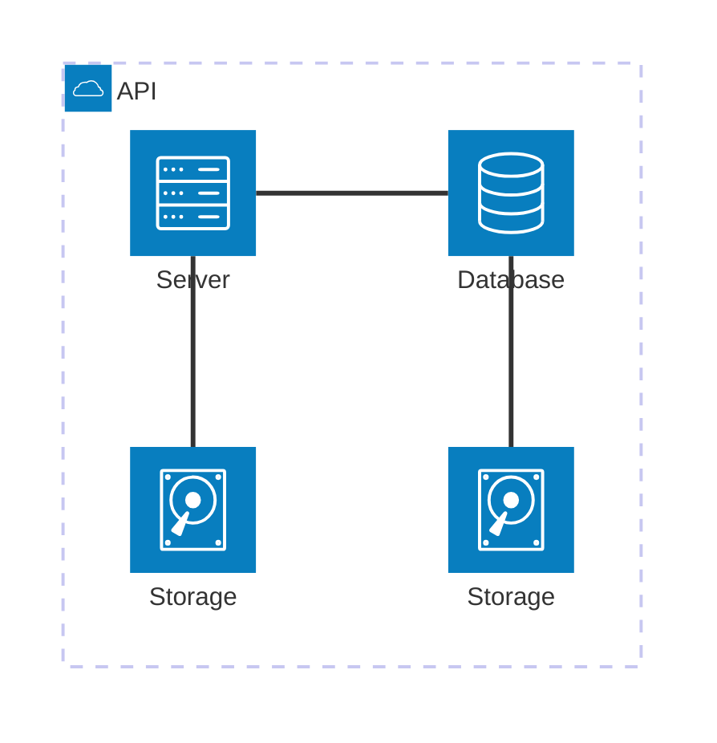

---

# About

The OpenLM Annapurna system runs as a set of microservices in Kubernetes.  
It uses Redis, Kafka, MongoDB, and SQL Server for infrastructure.  
You can deploy these services in-cluster or use managed services from cloud providers such as Azure or AWS.

## High-level diagram

## High-level diagram (Interactive)

