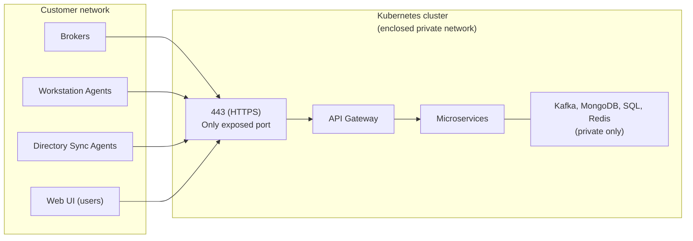

このページでは、すべてのデプロイパスに共通する OpenLM Platform のネットワーク要件を説明します。

## 概要

OpenLM Platform は、**単一の HTTPS（443 番ポート）Ingress エンドポイント** を公開します。クラスタネットワーク外からアクセス可能である必要があるのは、このポートだけです。フィールドエージェントと Web UI ユーザーの通信は、すべてこの単一エンドポイント経由で行われます。

:::info HTTP から HTTPS へのリダイレクト
通常、Ingress controller は 80 番ポート（HTTP）も公開し、HTTP リクエストを HTTPS にリダイレクトします。アプリケーショントラフィック自体は HTTP では提供されません。
:::

**Kubernetes クラスタ、そのノード、インフラサービス、内部ネットワークは、完全に閉じたプライベートネットワーク内に配置できます。** OpenLM はクラスタ内部に対する外部からの inbound アクセスを必要としません。リモート管理もなく、外部システムへの outbound 通信も不要です。唯一の外部公開面は、デプロイ時に構成する HTTPS Ingress です。

### Inbound トラフィック

すべての inbound トラフィックは、単一の HTTPS（443）Ingress エンドポイントから入ります。

| 送信元 | プロトコル | ポート | 用途 |
| --- | --- | --- | --- |
| **Broker** | HTTPS | 443 | ライセンスサーバーイベントの収集。ライセンスサーバーが稼働するマシンにインストール |
| **Workstation Agent** | HTTPS | 443 | ワークステーション利用イベントの収集。エンドユーザー端末にインストール |
| **Directory Sync Agent (DSA)** | HTTPS | 443 | ディレクトリスキャンと同期イベント。ディレクトリアクセス可能なマシンにインストール |
| **Web UI** | HTTPS | 443 | 管理画面、ダッシュボード、レポートにアクセスするユーザー |

すべてのエージェントとユーザーは、デプロイ時に設定した同じ完全修飾ドメイン名（FQDN）に接続します。クラスタネットワークの外部から Kubernetes ノード、API server、データベース、内部サービスへ直接アクセスする必要はありません。

### Outbound トラフィック

Kubernetes クラスタが必要とする outbound アクセスは、コンテナイメージ取得用のみです。

| 宛先 | プロトコル | ポート | 用途 |
| --- | --- | --- | --- |
| `public.ecr.aws/r3q3q2f4` | HTTPS | 443 | OpenLM コンテナイメージレジストリ |

実行時に、クラスタから他の outbound 接続は必要ありません。プラットフォームは外部の OpenLM サーバーとは通信せず、完全にお客様ネットワーク内で動作します。HTTP プロキシやファイアウォールの許可リストを使う環境では、上記レジストリエンドポイントを追加してください。

:::info 外部連携
このプラットフォームは ServiceNow などの外部サービスとも連携できます。そのような連携を有効にする場合は、それらのエンドポイントへの outbound アクセスも必要になります。必要に応じて、連携先をファイアウォール許可リストに追加してください。
:::

:::tip
エアギャップ環境では、コンテナイメージを事前にプライベートレジストリへロードできます。オフライン配布については OpenLM に相談してください。
:::

### TLS 証明書

TLS 証明書は、エージェントマシン、ユーザーブラウザ、そしてクラスタ内部で FQDN にコールバックするサービスを含む、プラットフォームに接続するすべてのマシンから信頼されている必要があります。これは HTTPS 接続を成立させるうえで重要です。

要件、設定手順、トラブルシューティングの詳細は [TLS certificates](./tls-certificates) を参照してください。

## オンプレミスマシン

上記のプラットフォーム共通要件に加え、オンプレミス Kubernetes クラスタではノード間通信と管理用アクセスが必要です。

### ノード間ポート（全ノード）

| ポート | プロトコル | 用途 |
| --- | --- | --- |
| 6443 | TCP | Kubernetes API server |
| 8472 | UDP | Flannel VXLAN overlay network |
| 10250 | TCP | Kubelet metrics |
| 51820 | UDP | Flannel WireGuard（有効時） |

### ロール別ポート

| ノードロール | ポート | プロトコル | 用途 |
| --- | --- | --- | --- |
| Control plane | 80 | TCP | HTTP Ingress（HTTPS へリダイレクト） |
| Control plane | 443 | TCP | HTTPS Ingress（agents, UI, API） |
| Infrastructure | 30432 | TCP | Power BI / 外部レポートツール用 PostgreSQL NodePort |

### ネットワークトポロジー

- すべてのノードは同一 L2 ネットワーク上に置くか、ノード間でポート制限のない完全な相互接続を確保する必要があります
- Control plane ノードが Ingress の入口です。DNS はこのノードの IP、またはその前段のロードバランサーに解決される必要があります
- 管理用アクセスとして、全ノードへの SSH（22 番ポート）が必要です

### Outbound（プロビジョニング時）

初期セットアップ時には、ノードは次へのアクセスも必要です。

| 宛先 | 用途 |
| --- | --- |
| `public.ecr.aws/r3q3q2f4` | OpenLM コンテナイメージ |
| Kubernetes distribution source | Kubernetes のインストール（ディストリビューション依存） |
| AlmaLinux / RHEL mirrors | OS パッケージ更新（`dnf`） |

インストール後に必要なのは、コンテナレジストリエンドポイントのみです。

## プライベートクラウド (AWS)

AWS では、ネットワークは public / private subnets を持つ VPC で構成されます。

### VPC レイアウト

| コンポーネント | 詳細 |
| --- | --- |
| VPC CIDR | `/22` ブロック（例: `10.0.0.0/22`） |
| Private subnets | 3 つ（各 availability zone に 1 つ）。EKS ノードとマネージドサービス用 |
| Public subnets | 3 つ。ロードバランサーと NAT gateway 用 |
| NAT gateway | 1 つ。private subnets からの outbound internet 用 |
| S3 endpoint | NAT を使わずに S3 へアクセスするための gateway endpoint |

### Security groups

| サービス | 許可ソース | ポート | プロトコル |
| --- | --- | --- | --- |
| EKS API server | 設定した CIDRs (`eks_public_access_cidrs`) | 443 | TCP |
| RDS SQL Server | EKS cluster security group | 1433 | TCP |
| MSK (Kafka) | EKS cluster security group | 9096 | TCP |
| ElastiCache (Redis) | EKS cluster security group | 6379 | TCP |

### Ingress

外部トラフィック（エージェントとユーザー）は、public subnets 上の AWS load balancer を通って入り、private subnets 上の Ingress controller に 443 と 80 で転送されます。

### Outbound

- Private subnets 上のワークロードノードは NAT gateway 経由でインターネットへ到達します
- コンテナイメージは NAT 経由で `public.ecr.aws/r3q3q2f4` から取得されます

## プライベートクラウド (Azure)

Azure では、AKS の Azure CNI モードを使った VNet 構成を利用します。

### VNet レイアウト

| コンポーネント | 詳細 |
| --- | --- |
| VNet CIDR | `/22` ブロック（例: `10.0.0.0/22`）。1,024 個の IP アドレスを提供 |
| ネットワークモード | Azure CNI（各 Pod が VNet IP を持つ） |
| IP 容量 | Pod、ノード、拡張分を含めて約 400 IP |

### ネットワークサイジング

Azure CNI では、すべての Pod が VNet から IP アドレスを消費します。

- ノードあたり約 29 個の Pod IP
- 6 から 7 ノードで約 174 から 203 個の Pod IP
- 約 143 個の稼働 Pod とノード IP は、拡張余地を残したまま `/22` ブロックに収まる

### Ingress

外部トラフィックは、443 と 80 で Azure load balancer または Application Gateway に入り、AKS の Ingress controller に転送されます。

### マネージドサービス接続

Azure SQL Managed Instance と Azure Cache for Redis は、private endpoints または VNet integration 経由で利用します。マネージドサービスをパブリックインターネットへ公開する必要はありません。

### Outbound

- AKS ノードは `public.ecr.aws/r3q3q2f4` からコンテナイメージを取得します
- AKS の outbound type とファイアウォールルールを設定し、レジストリエンドポイントへのアクセスを許可してください
