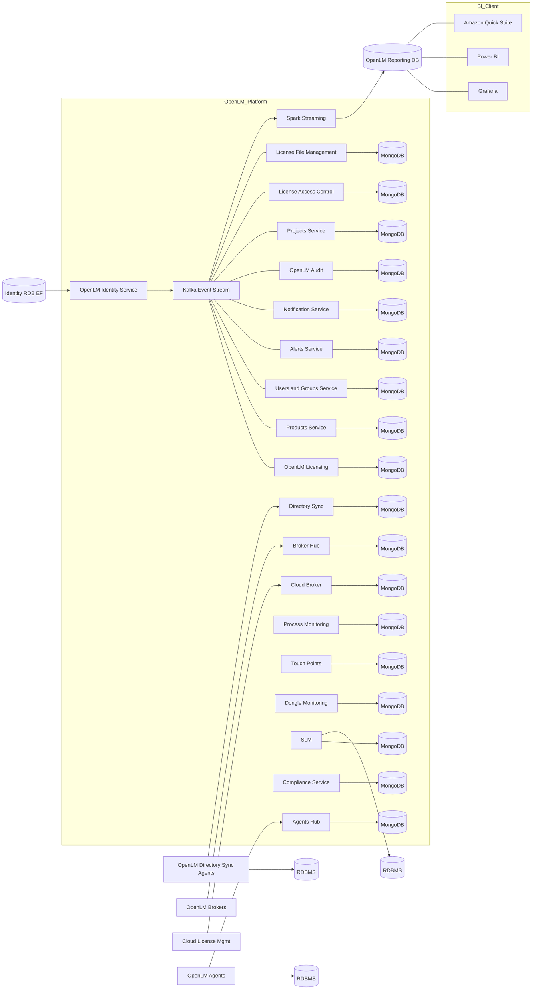

:::info[このページの対象者]
このページは、プラットフォームが内部でデータを処理する仕組みを理解する必要がある管理者およびアーキテクトを対象としています。OpenLM を初めてセットアップする場合は、代わりに[前提条件](./prerequisites)ページから始めてください。
:::

OpenLM Platform は、Workstation Agent と Broker を通じてアプリケーションと実行ファイルのデータを収集します。これらのコンポーネントは、組織の完全修飾ドメイン名 (FQDN) または DNS 名を表す OpenLM Gateway に接続します。Gateway はデータを OpenLM サービスに転送し、サービスは適切なデータベースに保存します。

## 主要コンポーネント

プラットフォームは、以下のコンポーネントで構成されています。

- **Workstation Agent**: 個々のユーザーマシンからデータを収集します。  
- **Broker**: ライセンスマネージャーサーバー上で稼働します。ライセンスの使用状況データを収集し、関連サービスに送信します。  
- **OpenLM Gateway**: エントリーポイントとして機能し、データを個々のサービスにルーティングします。  
- **OpenLM サービス**: 収集したデータを処理、エンリッチ、管理します。  
- **データベース**: 処理されたデータを、サーバーデータベース、Identity サービスデータベース、DSS データベース、レポートデータベースなどの専用システムに保存します。

## マイクロサービスと Kubernetes

OpenLM Platform は、Kubernetes クラスター上にデプロイされたマイクロサービスで動作します。  
各サービスは、Kubernetes ノード上のポッド内のコンテナで稼働します。  
各サービスはデータを内部データベースに保存し、非同期処理用に Kafka をメッセージキューとして使用します。

## アーキテクチャのレベル

### レベル 1: 高レベルのデータフロー

- Workstation Agent、Broker、その他のサービスは、それぞれのデータベースにデータを書き込みます。  
- サービスは Kafka トピックにデータを公開します。  
- Reporting サービスは Kafka のデータを集約します。  
- Reporting サービスはデータをレポートデータベースに保存します。  
- レポートダッシュボードは、レポートデータベースからデータを読み取ります。

*OpenLM Platform レベル 1 アーキテクチャ*

### レベル 2: 詳細なデータパイプライン

- Workstation Agent と Broker が PC とサーバーからデータを収集します。  
- Agent Hub と Broker Hub がこのデータを集約します。  
- Agent Hub と Broker Hub のデータは、MongoDB と Kafka に保存されます。  
- 他のサービス (User、Project、Server) が関連する Kafka トピックを消費します。  
- Enrichment サービスがすべてのサービスからのデータを統合・エンリッチし、Kafka に再公開します。  
- Apache Spark がエンリッチされた Kafka データをレポート用に集約します。  
- Spark は結果をレポートデータベースに書き込みます。  
- ビジネスインテリジェンスツールがレポートデータベースにアクセスします。

*OpenLM Platform レベル 2 アーキテクチャ*

### 包括的なアーキテクチャ

この図は、Identity、イベントストリーミング、ハブ、モニタリング、コアサービス、レポートフローを含む OpenLM Platform の全体的なアーキテクチャを表しています。

## エンリッチメントサービス

OpenLM Platform には、収集したデータを統合・強化するためのエンリッチメントサービスが含まれています。

- **Allocation Enrichment サービス**: 割り当て ID を使用して、割り当てデータを追加します。  
- **Usage Enrichment サービス**: セッション ID を使用して、使用状況データを強化します。  
- **Denials Enrichment サービス**: 拒否 ID を使用して、拒否データを処理します。

## データストレージとリカバリ

OpenLM Platform は、データの損失や破損に備えてデータリカバリをサポートするため、ステージングデータベースを使用しています。  
このステージングデータは後に MongoDB に移動され、内部のリカバリソースとして機能します。
