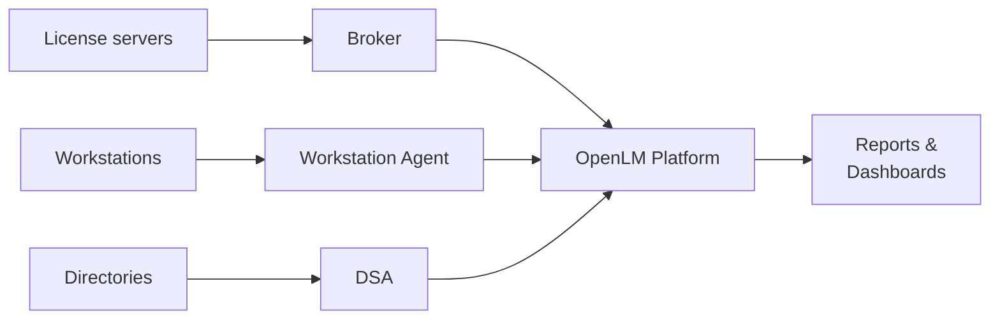

import Link from '@docusaurus/Link';

OpenLM は、エンジニアリング、科学、技術分野の環境向けに設計されたソフトウェアライセンス管理およびソフトウェア資産管理（SAM）プラットフォームです。ライセンスサーバーやユーザーのワークステーションから使用状況データを収集し、クラウドプラットフォームで処理し、コンプライアンス、コスト最適化、アクセス制御に役立つレポートを提供します。

OpenLM は、FlexNet、DSLS、Sentinel RMS、Reprise、LM-X などを含む 100 種類以上のライセンスマネージャーに対応しています。また、Autodesk Cloud のようなクラウドベースのライセンスプラットフォームにも対応しています。

## OpenLM の仕組み

OpenLM は、データ収集のために 3 つのオンプレミスコンポーネントを使用します。

- **Broker** は、ライセンスサーバー上で稼働し、ライセンスの使用状況データを収集します。
- **Workstation Agent** は、エンドユーザーのマシン上で稼働し、アプリケーションのアクティビティデータを収集します。
- **Directory Synchronization Agent (DSA)** は、ディレクトリ (LDAP、Microsoft Entra ID) からユーザーとグループのデータを同期します。

これらのコンポーネントは、データを OpenLM Platform に送信します。Platform はデータを処理、エンリッチ、保存します。処理結果はダッシュボードとレポートで確認できます。

マイクロサービスアーキテクチャ、Kafka イベントストリーミング、データパイプラインの詳細については、[OpenLM Platform アーキテクチャ](./architecture)を参照してください。

## パスを選択する

  

    

      

        <h3>IT 管理者</h3>
      

      

        
プラットフォームをデプロイし、オンプレミスコンポーネントをインストールし、ライセンスサーバーに接続します。

      

      

        <Link className="button button--primary button--block" to="/cloud/getting-started/prerequisites">セットアップを開始</Link>
      

    

  

  

    

      

        <h3>ライセンス管理者</h3>
      

      

        
ライセンスポリシーを設定し、オートメーションをセットアップし、コンプライアンスを監視します。

      

      

        <Link className="button button--primary button--block" to="/cloud/category/licenses-and-features">ライセンスと機能</Link>
      

    

  

  

    

      

        <h3>エンドユーザー</h3>
      

      

        
ライセンスの空き状況を確認し、ダッシュボードを表示し、Workstation Agent について理解します。

      

      

        <Link className="button button--primary button--block" to="/cloud/category/for-end-users">エンドユーザー向け</Link>
      

    

  

## 主な機能

| 機能 | 説明 | 詳細 |
|---|---|---|
| 地域コンプライアンス | 地理的な利用ルールを定義し、それに違反するライセンス利用を検出します。 | [コンプライアンス](/cloud/compliance) |
| クラウドライセンス管理 | SaaS およびトークンベースのライセンスモデルを監視・制御します。 | [Cloud Broker](/cloud/data-collection/cloud-broker) |
| 高度な使用状況分析 | ユーザー、機能、ワークステーション別にリアルタイムおよび履歴の使用状況データを表示します。 | [BIレポート](/cloud/category/bi-reports) |
| アクセスの制御と適用 | ライセンスの自動解放、アクセス制限の適用、拒否の削減を実現します。 | [ライセンスアクセス制御](/cloud/automations/lac) |
| ITSM および CRM 統合 | ライセンスアラートを ServiceNow、Zendesk、Zoho、Freshworks、Salesforce のチケットに変換します。 | [統合](/cloud/category/integrations) |
| マルチ環境対応 | 分散、仮想化、クラウドホスト環境にわたってライセンスを管理します。 | [デプロイ](/cloud/category/deployment-and-operations) |

:::tip[OpenLM の用語に慣れていない方へ]
本ドキュメント全体で使用される主要な用語の定義については、[用語集](/cloud/glossary) を参照してください。
:::

:::info[次のステップ]
OpenLM をセットアップする準備はできましたか？[前提条件](./prerequisites) に進んで、開始前に必要な項目を確認してください。
:::
