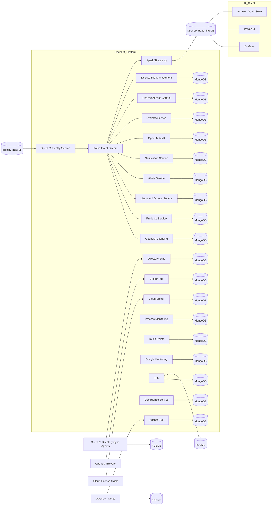

# OpenLM プラットフォームのアーキテクチャ

OpenLM プラットフォームは、Workstation Agent と Broker を通じてアプリケーションや実行ファイルのデータを収集します。これらのコンポーネントは組織の FQDN/DNS 名を表す OpenLM Gateway に接続し、Gateway から各 OpenLM サービスへデータが転送され、適切なデータベースに保存されます。

## 主要コンポーネント

- **Workstation Agent**: 各ユーザーマシンからデータを収集  
- **Broker**: ライセンスマネージャーサーバー上で稼働し、使用状況を収集して各サービスへ送信  
- **OpenLM Gateway**: エントリーポイントとしてデータを各サービスへルーティング  
- **OpenLM サービス群**: 収集データの処理・エンリッチ・管理を実施  
- **データベース**: Server DB、Identity DB、DSS DB、Reporting DB などに格納

## マイクロサービスと Kubernetes

OpenLM プラットフォーム（Annapurna）は Kubernetes クラスタ上にデプロイされたマイクロサービスで構成されています。  
各サービスはノード上の Pod/コンテナ内で動作し、内部 DB にデータを保持するとともに、非同期処理に Kafka を使用します。

## アーキテクチャのレベル

### レベル 1: ハイレベルなデータフロー

- Workstation Agent、Broker、その他のサービスは各自の DB に書き込みます。  
- 各サービスはデータを Kafka トピックに公開します。  
- Reporting サービスが Kafka のデータを集約します。  
- 集約結果を Reporting DB に保存します。  
- ダッシュボードは Reporting DB から読み取り表示します。

*OpenLM Platform Level 1 architecture*

### レベル 2: 詳細なデータパイプライン

- Workstation Agent と Broker が PC/サーバーからデータを収集  
- Agent Hub と Broker Hub がデータを集約  
- 集約データを MongoDB と Kafka に保存  
- 他サービス（User/Project/Server など）が該当トピックを購読  
- Enrichment Service が各サービスのデータを統合・強化し、再度 Kafka へ公開  
- Apache Spark が強化データを集計してレポート用データを生成  
- Spark が結果を Reporting DB に書き込み  
- BI ツールが Reporting DB にアクセス

*OpenLM Platform Level 2 architecture*

### 包括的なアーキテクチャ

次の図は、アイデンティティ、イベントストリーム、各ハブ、監視、コアサービス、レポート処理を含む全体像を示します。

## Enrichment サービス

OpenLM プラットフォームには、収集データを統合・強化するための Enrichment サービス群が含まれます。

- **Allocation Enrichment Service**: allocation ID を用いて割当データを付加します。  
- **Usage Enrichment Service**: session ID を用いて使用データを強化します。  
- **Denials Enrichment Service**: denial ID を用いて拒否(デナイアル)データを処理します。

## データ保存とリカバリ

OpenLM プラットフォームは、データの損失や破損に備えるため、ステージング用データベースを使用します。  
ステージングのデータは後続で MongoDB に移送され、内部的な復旧ソースとして機能します。
