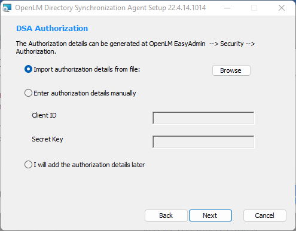

これは Cloud Directory Sync のセットアップに関する短いガイドです。

> 詳細な説明は、[Directory Synchronization comprehensive guide (v21 and higher)](/legacy/directory-sync/configuration) を参照してください。

## 前提条件

- [Software License Management Cloud (SLMC) のアカウント](/legacy/slmc/)
- *Support（support@openlm.com）に連絡して、アカウント用の DSS データベースを作成してください。*

## DSA の認可ファイルを生成し、DSA と DSS を接続する（前半）

Directory Synchronization Agent (DSA) が Directory Synchronization Service (DSS) と連携できるように、EasyAdmin から認可ファイルを生成します:

1. Software License Management Cloud アカウントにログインします。
2. **System & Security** → **Security** → **Authorization** に移動します。
3. **Add** をクリックし、ドロップダウンから **DSA** を選択して認可 JSON ファイルをダウンロードします。分かりやすい説明を入力し、**SAVE** をクリックします。Secret Key は 1 度だけ表示されるため、ウィンドウを閉じる前に安全な場所に保管してください。

## Directory Synchronization Agent (DSA) をインストール

1. OpenLM Downloads ページから最新の DSA インストーラーをダウンロードして実行します。
2. “I agree to the license terms and conditions” にチェックを入れて **Next** をクリックします。
3. エージェントインスタンスの説明名（スペースなし）を入力し、ポート（既定 `8081`）を確認または変更して、Server version に **Cloud** を選択し **Next** をクリックします。
4. 次のいずれかで認可ファイルを取り込みます:
	- **Browse** で認可 JSON ファイルを取り込みます。
	- **Enter** で認可情報を手入力します。
	- **Add authorization details later**（認可情報を追加するまで DSA は動作しません）。
	認可情報を入力したら **Next** をクリックします。

5. インストール先フォルダーを選択します（既定: `C:\Program Files\OpenLM\OpenLM Directory Synchronization Agent`）。必要に応じて **Browse** で変更し、**Next** をクリックします。
6. **Finish** をクリックしてインストールウィザードを閉じます。

## DSA と DSS の接続を承認する（後半）

インストール後、Agent Manager で DSA を承認して DSS と連携できるようにします:

1. OpenLM Platform アカウントにログインします。**Start** → **Administration** → **Directory Synchronization** に移動します（新しいタブで開きます）。
2. DSS にレポートするよう設定された新規 DSA は、運用開始前に承認が必要です。
3. **Agent Manager** タブをクリックします。
4. ステータスが **Pending approval** のエージェント行をダブルクリックします（または Edit Agent アイコンをクリックします）。
5. **Approve Agent** 画面で **Status** を **Enabled** に設定し、**Approve** をクリックします。

---
[このガイド](/legacy/directory-sync/configuration) でより詳細な内容を確認できます。
